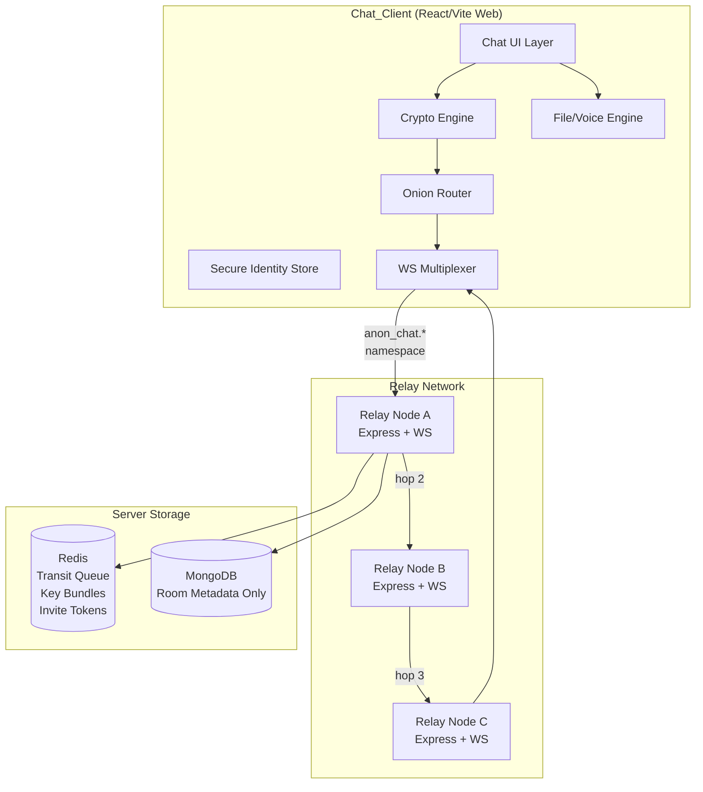

# Design Document — Codeva Anonymous Chat

## Overview

Codeva Anonymous Chat is a WhatsApp-style real-time messaging system embedded in the Codeva web application. Users communicate pseudonymously via device-generated Ed25519 key pairs — no email, phone number, or username is required. The system supports 1-on-1 Direct Messages, group Rooms of up to 100 participants, end-to-end encryption via X3DH + Double Ratchet, disappearing messages, file/image/voice sharing, and onion-routed delivery through a multi-hop Relay Network.

**Key Design Principles:**
- Zero server-side message persistence: content lives only in Redis transit buffers and in clients.
- Identity is derived entirely from cryptographic keys, never from personal data.
- Advanced features (E2EE, disappearing messages, file sharing, voice) are plan-gated; only MAX subscribers access them.
- The existing Express/WebSocket/Redis/MongoDB stack is extended rather than replaced.

### Research Summary

The cryptographic foundation follows the Signal Protocol specifications ([X3DH](https://signal.org/docs/specifications/x3dh/), [Double Ratchet](https://signal.org/docs/specifications/doubleratchet/)), which provide forward secrecy, post-compromise security, and cryptographic deniability. The Sender Keys protocol ([Signal docs](https://signal.org/docs/)) is used for group E2EE to enable server-side fan-out without per-member encryption. Onion routing is implemented as custom layered Curve25519 encryption over WebSocket hops, inspired by Lightning Network's [BOLT-04 Sphinx packet format](https://github.com/lightning/bolts/blob/master/04-onion-routing.md) rather than full Tor integration, avoiding the complexity of a separate overlay network. Cryptographic primitives are provided by [`@noble/curves`](https://github.com/paulmillr/noble-curves) and [`@noble/hashes`](https://github.com/paulmillr/noble-hashes) — audited, zero-dependency JavaScript libraries. Voice messages use [`opus-recorder`](https://github.com/chris-rudmin/opus-recorder) (WebAssembly libopus) for Ogg/Opus encoding in the browser.

Content was rephrased for compliance with licensing restrictions.

---

## Architecture

The system is divided into four logical layers:



### Component Responsibilities

| Component | Location | Responsibility |
|---|---|---|
| Chat UI Layer | Client | Message list, composer, file picker, voice recorder, TTL controls |
| Crypto Engine | Client | Ed25519 key gen, X3DH, Double Ratchet, Sender Keys, AES-GCM |
| Secure Identity Store | Client | IndexedDB + SubtleCrypto (browser) |
| File/Voice Engine | Client | Chunking, SHA-256 integrity, Opus encoding |
| Onion Router | Client | Builds layered-encrypted Sphinx packets, selects 3-hop routes |
| WS Multiplexer | Client | Namespaces chat frames over existing daemon WebSocket |
| Relay Node | Server | Validates plan, strips/forwards onion layer, manages Redis queues |
| Redis | Server | Key bundles (30-day TTL), in-transit message queue (72h TTL), invite tokens |
| MongoDB | Server | Room metadata, participant counts, invite link tokens (no content) |

---

## Components and Interfaces

### 1. Identity Manager (`src/chat/identity/IdentityManager.ts`)

Responsible for lifecycle management of the Anonymous_Identity.

```typescript
interface AnonymousIdentity {
  publicKey: Uint8Array        // Ed25519 public key (32 bytes)
  privateKey: Uint8Array       // Ed25519 private key (32 bytes) — never leaves device
  identifier: string           // hex(SHA-256(publicKey)) — displayed pseudonym
  createdAt: number
}

interface IdentityManager {
  initialize(): Promise<AnonymousIdentity>
  // Loads existing key from secure storage, generates one if absent.
  getIdentity(): AnonymousIdentity | null
  exportEncrypted(passphrase: string): Promise<Uint8Array>  // AES-256-GCM encrypted backup
  importEncrypted(data: Uint8Array, passphrase: string): Promise<void>
}
```

Secure storage backend: IndexedDB + `SubtleCrypto` (browser-native, no extra dependency).

### 2. Key Bundle Manager (`src/chat/crypto/KeyBundleManager.ts`)

Manages X3DH pre-keys and publication to the Relay Server.

```typescript
interface KeyBundle {
  identityKey: Uint8Array           // Ed25519 public key
  signedPreKey: {
    keyId: number
    publicKey: Uint8Array           // X25519 public key
    signature: Uint8Array           // Ed25519 signature over publicKey
  }
  oneTimePreKeys: Array<{
    keyId: number
    publicKey: Uint8Array           // X25519 public key
  }>
}

interface KeyBundleManager {
  generateBundle(identity: AnonymousIdentity): KeyBundle
  // Produces 1 identity key + 1 signed pre-key + 10 one-time pre-keys
  publishBundle(bundle: KeyBundle): Promise<void>
  fetchBundle(recipientId: string): Promise<KeyBundle>
  replenishOneTimePreKeys(): Promise<void>
}
```

### 3. Crypto Engine (`src/chat/crypto/CryptoEngine.ts`)

Implements X3DH session establishment and Double Ratchet message encryption.

```typescript
interface SessionSecret {
  sharedSecret: Uint8Array          // 32-byte X3DH output
  associatedData: Uint8Array
}

interface RatchetState {
  rootKey: Uint8Array
  sendChainKey: Uint8Array
  recvChainKey: Uint8Array
  sendMessageKeys: Map<number, Uint8Array>
  messageNumber: number
}

interface CryptoEngine {
  // X3DH
  initiateSession(myIdentity: AnonymousIdentity, recipientBundle: KeyBundle): Promise<SessionSecret>
  receiveSession(myIdentity: AnonymousIdentity, initialMessage: InitialMessage): Promise<SessionSecret>
  // Double Ratchet
  initRatchet(secret: SessionSecret): RatchetState
  encryptMessage(state: RatchetState, plaintext: Uint8Array): { ciphertext: Uint8Array; header: RatchetHeader }
  decryptMessage(state: RatchetState, header: RatchetHeader, ciphertext: Uint8Array): Uint8Array | DecryptionError
  // Group — Sender Keys
  generateSenderKey(): SenderKey
  encryptGroupMessage(senderKey: SenderKey, plaintext: Uint8Array): Uint8Array
  decryptGroupMessage(senderKey: SenderKey, ciphertext: Uint8Array): Uint8Array | DecryptionError
}
```

### 4. WebSocket Multiplexer (`src/chat/transport/WsMultiplexer.ts`)

Namespaces all anonymous chat frames within the existing daemon WebSocket connection using a dedicated `type` prefix, avoiding a second TCP connection.

```typescript
// Chat frame envelope — sent over the existing WS connection
interface ChatFrame {
  type: `anon_chat.${string}`     // e.g. "anon_chat.message", "anon_chat.key_bundle"
  payload: unknown
  seq: number                     // monotonic sequence number for ordering
}

// Example message types
// anon_chat.message         — encrypted message packet
// anon_chat.key_bundle_pub  — publish Key_Bundle
// anon_chat.key_bundle_req  — fetch Key_Bundle for recipient
// anon_chat.room_join        — join a room
// anon_chat.room_leave       — leave a room
// anon_chat.delivery_ack     — delivery acknowledgment
// anon_chat.onion_packet     — wrapped onion-routed packet
// anon_chat.invite_create    — create invite link
// anon_chat.invite_join      — join via invite link
```

### 5. Onion Router (`src/chat/transport/OnionRouter.ts`)

Builds Sphinx-inspired layered encryption packets for 3-hop delivery (MAX plan only).

```typescript
interface RelayHop {
  nodeId: string            // Relay node public key (Curve25519)
  address: string           // ws://relay-N.codeva.app
}

interface OnionPacket {
  version: 1
  ephemeralKey: Uint8Array  // Curve25519 ephemeral public key
  routingInfo: Uint8Array   // encrypted per-hop routing headers (1300 bytes fixed)
  payload: Uint8Array       // layered-encrypted message payload
}

interface OnionRouter {
  buildPacket(hops: RelayHop[], payload: Uint8Array): OnionPacket
  peelLayer(myPrivateKey: Uint8Array, packet: OnionPacket): { nextHop: string; innerPacket: OnionPacket } | FinalPayload
  selectRoute(excludedNodes?: string[]): RelayHop[]
  // Selects 3 relay nodes, avoiding excluded (for retry after hop failure)
}
```

### 6. File/Voice Engine (`src/chat/media/FileEngine.ts`)

Handles chunking, integrity, and Opus encoding.

```typescript
interface FileTransferMetadata {
  fileId: string            // UUID
  mimeType: string
  totalSize: number
  totalChunks: number
  sha256: string            // hex-encoded SHA-256 of full file
  disappearsAt?: number     // unix timestamp, if applicable
}

interface FileEngine {
  validateFile(file: File): ValidationResult       // mime + size check
  chunkAndEncrypt(file: File, sessionKey: Uint8Array): AsyncGenerator<EncryptedChunk>
  reassembleAndDecrypt(chunks: EncryptedChunk[], sessionKey: Uint8Array, meta: FileTransferMetadata): Promise<Uint8Array>
  verifyIntegrity(data: Uint8Array, expectedHash: string): boolean
  // Voice
  startRecording(): Promise<void>
  stopRecording(): Promise<Blob>    // Ogg/Opus blob, max 5 min
}
```

### 7. Relay Server Extension (`backend/src/chat/`)

Three new modules added to the existing Express server:

- **`chatWsHandler.ts`** — processes `anon_chat.*` WebSocket frames, routes to appropriate sub-handlers.
- **`relayHandler.ts`** — strips one onion layer and forwards to the next hop or final recipient.
- **`planGuard.ts`** — middleware verifying plan tier before executing MAX-gated operations.
- **`roomRegistry.ts`** — manages Room state in Redis and Room metadata in MongoDB.
- **`inviteService.ts`** — creates and validates signed invite tokens using HMAC-SHA256.

---

## Data Models

### Client-Side (IndexedDB / SubtleCrypto)

```typescript
// Stored in IndexedDB, private key AES-GCM encrypted via SubtleCrypto — never sent to server
interface StoredIdentity {
  publicKey: string        // hex
  privateKey: string       // hex — AES-GCM encrypted at rest
  identifier: string       // hex(SHA-256(publicKey))
  createdAt: number
}

// Per-conversation session state
interface SessionState {
  sessionId: string
  participantId: string    // remote identifier
  isGroup: boolean
  roomId?: string
  ratchetState: RatchetState        // serialized JSON
  senderKey?: SenderKey             // for groups
  ttl?: number                      // disappearing message TTL in seconds, null = off
  createdAt: number
  lastMessageAt: number
}

// Local message store (content never sent to server's persistent DB)
interface LocalMessage {
  messageId: string        // UUID
  sessionId: string
  direction: 'sent' | 'received'
  plaintextContent?: string         // null if decryption failed
  attachmentPath?: string           // local file path for file/voice messages
  encryptionStatus: 'e2ee' | 'tls_only' | 'decryption_failed'
  deliveryStatus: 'sent' | 'delivered' | 'read'
  disappearsAt?: number             // unix ms timestamp, null = permanent
  createdAt: number
}
```

### Server-Side Redis Keys

```
# Key Bundle (30-day TTL)
key_bundle:{identifier}  →  JSON(KeyBundle)

# In-transit message queue (72-hour TTL)
msg_queue:{recipientId}  →  List<JSON(MessagePacket)>

# Room membership (no TTL — cleared on room deletion)
room:{roomId}:members    →  Set<identifier>

# Invite token (expiry TTL)
invite:{token}           →  JSON({ roomId, createdAt, expiresAt, revokedAt? })

# Relay network node registry
relay:nodes              →  List<JSON(RelayHop)>
```

### Server-Side MongoDB Collections

Only non-content metadata is persisted in MongoDB, per Requirement 13.4:

```javascript
// Collection: chat_rooms
{
  _id: ObjectId,
  roomId: String,            // unique UUID
  participantCount: Number,  // maintained by atomicInc/Dec
  createdAt: Date,
  createdByHash: String,     // SHA-256 of creator's identifier (anonymized)
}

// Collection: chat_invite_tokens
// Tokens are stored in Redis for fast validation; MongoDB stores an audit record
{
  _id: ObjectId,
  token: String,             // HMAC-signed token (opaque)
  roomId: String,
  expiresAt: Date,
  revokedAt: Date | null,
  createdAt: Date,
}
```

> **No message content, sender identifiers, IP addresses, or routing paths are stored in MongoDB** — only the structural room metadata required for capacity enforcement and invite management.

---

## Correctness Properties

*A property is a characteristic or behavior that should hold true across all valid executions of a system — essentially, a formal statement about what the system should do. Properties serve as the bridge between human-readable specifications and machine-verifiable correctness guarantees.*

After prework analysis, the following properties were identified from testable acceptance criteria. Redundant properties have been eliminated: 1.3 (key idempotence) subsumes part of 1.1; 5.4 is covered by 5.1's round-trip; 6.3 is subsumed by 6.2; 7.3/7.6 are subsumed by 7.2/7.5 respectively; 3.5 and 13.3 are the same property.

---

### Property 1: Identity Derivation is Deterministic

*For any* Ed25519 public key, the derived pseudonymous identifier must equal the lowercase hex-encoded SHA-256 hash of that public key's raw bytes, and must equal the same value on every call.

**Validates: Requirements 1.2**

---

### Property 2: Identity Initialization is Idempotent

*For any* device state that already has a stored Anonymous_Identity key pair, calling `IdentityManager.initialize()` must return the same key pair without generating a new one. The identifier after two consecutive calls must be identical.

**Validates: Requirements 1.3**

---

### Property 3: Key Bundle Structural Validity

*For any* generated Anonymous_Identity, calling `KeyBundleManager.generateBundle()` must produce a Key_Bundle containing the identity public key, a signed pre-key whose signature is verifiable against the identity public key, and at least 10 one-time pre-keys.

**Validates: Requirements 2.1**

---

### Property 4: X3DH Shared Secret Symmetry

*For any* two key bundles (initiator's and responder's), running the X3DH protocol from the initiator's side and from the responder's side must produce identical shared secrets. No participant should have a different session key than their counterpart.

**Validates: Requirements 2.2**

---

### Property 5: Double Ratchet Key Uniqueness

*For any* ratchet state and any sequence of n ≥ 2 messages, all message encryption keys derived during that sequence must be pairwise distinct. No two messages may be encrypted with the same key.

**Validates: Requirements 2.3, 5.6**

---

### Property 6: E2EE Encryption Round-Trip

*For any* plaintext byte array and any valid session key, the result of encrypting then decrypting must equal the original plaintext. Additionally, the ciphertext must not equal the plaintext (i.e., encryption is not identity).

**Validates: Requirements 5.1, 5.2, 5.4**

---

### Property 7: Decryption Failure is Non-Crashing

*For any* randomly generated or bit-corrupted ciphertext, calling `CryptoEngine.decryptMessage()` must return a typed `DecryptionError` result and must not throw an unhandled exception or crash the session.

**Validates: Requirements 5.5**

---

### Property 8: Message Length Validation

*For any* string, `validateMessageLength(s)` must return `valid` if and only if the string's length is less than or equal to 4,096 characters. All strings longer than 4,096 characters must be rejected.

**Validates: Requirements 3.1**

---

### Property 9: Message Delivery Status is Always Valid

*For any* message lifecycle transition (created → sent → delivered → read), the `deliveryStatus` field must always contain exactly one of the values `'sent'`, `'delivered'`, or `'read'`. No other value is permissible.

**Validates: Requirements 3.4**

---

### Property 10: Basic Plan Messages are Not E2EE-Encrypted

*For any* message sent by a user with `plan = 'free'` or `plan = 'pro'`, the outgoing `ChatFrame` must not have an E2EE encryption header set. The message must travel without a Double Ratchet ciphertext wrapper.

**Validates: Requirements 3.6**

---

### Property 11: Room Capacity Invariant

*For any* Room in any state, the number of participants must never exceed 100. Every join attempt that would cause the count to exceed 100 must be rejected with a capacity-exceeded error, leaving the count unchanged.

**Validates: Requirements 4.2, 4.3, 10.6**

---

### Property 12: Room Membership Removal

*For any* Room and any participant in that room's member list, after `leaveRoom(participantId)` is called, that participant's identifier must not appear in the room's active member list.

**Validates: Requirements 4.5**

---

### Property 13: Post-Delivery Redis Cleanup

*For any* Message_Packet that has been acknowledged as delivered, querying Redis for that packet's ID must return null. No delivered packet should remain in the transit queue.

**Validates: Requirements 3.5, 13.3**

---

### Property 14: Disappearing Message TTL Deletion

*For any* Disappearing_Message with any TTL value, once the TTL has elapsed (whether the client was open or closed), that message must not be retrievable from local storage. The property must hold for both sender and recipient devices.

**Validates: Requirements 6.2, 6.3, 6.5**

---

### Property 15: TTL Change Does Not Affect Existing Messages

*For any* session with existing messages and a configured TTL T, changing the TTL to T2 must not alter the `disappearsAt` timestamp of any message that was sent before the change. Previously sent messages must retain their original TTL.

**Validates: Requirements 6.6**

---

### Property 16: MIME Type Validation Completeness

*For any* MIME type string, `FileEngine.validateFile()` must accept a file if and only if its MIME type is one of: `image/jpeg`, `image/png`, `image/gif`, `image/webp`, `application/pdf`, `text/plain`, `application/zip`. All other MIME types must be rejected.

**Validates: Requirements 7.1**

---

### Property 17: File Size Validation

*For any* file size in bytes, `FileEngine.validateFile()` must accept the file if and only if the size is less than or equal to 25 × 1024 × 1024 bytes (26,214,400 bytes).

**Validates: Requirements 7.2**

---

### Property 18: File Chunking Size Invariant

*For any* binary file, `FileEngine.chunkAndEncrypt()` must produce chunks such that every chunk's plaintext payload size is less than or equal to 65,536 bytes (64 KB). No chunk may exceed this limit.

**Validates: Requirements 7.4**

---

### Property 19: File Transfer Integrity Round-Trip

*For any* binary file, splitting it into chunks, reassembling the chunks, and computing the SHA-256 of the reassembled data must produce the same hash as computing SHA-256 on the original file. If any chunk is corrupted, the hash comparison must fail and the file must be discarded.

**Validates: Requirements 7.5, 7.6**

---

### Property 20: Disappearing File Deletion

*For any* local message that contains a file attachment and has a `disappearsAt` timestamp, after that timestamp has elapsed both the message record and the referenced local file must be absent from storage.

**Validates: Requirements 7.7**

---

### Property 21: Voice Recording Duration Enforcement

*For any* recording session, if the elapsed recording time exceeds 300 seconds (5 minutes), recording must auto-stop and the audio must be prepared for sending without further input from the user.

**Validates: Requirements 8.2, 8.3**

---

### Property 22: MAX Plan Onion Route Minimum Hops

*For any* message sent by a MAX_Plan user, `OnionRouter.selectRoute()` must return a path with at least 3 relay hops. No MAX plan message may be delivered in fewer than 3 hops.

**Validates: Requirements 9.1**

---

### Property 23: Onion Layers Reveal Only the Next Hop

*For any* n-hop onion packet, peeling one layer using the first relay's private key must reveal exactly the address of the second relay and an inner packet, but must not reveal any subsequent hop addresses or the plaintext payload.

**Validates: Requirements 9.2**

---

### Property 24: Alternate Route on Hop Failure

*For any* route selection where one relay node is marked as unreachable, `OnionRouter.selectRoute(excludedNodes)` must return a valid 3-hop route that does not include any of the excluded nodes. The routing must not simply fail without retrying.

**Validates: Requirements 9.4**

---

### Property 25: Basic Plan Uses Single-Hop Routing

*For any* message sent by a Basic_Plan user, the constructed route must contain exactly 1 relay hop with no onion wrapping.

**Validates: Requirements 9.6**

---

### Property 26: Invite Token Round-Trip

*For any* Room_ID and expiry duration, the token produced by `InviteService.createInviteLink(roomId, expiry)` when parsed by `InviteService.parseInviteLink(token)` must yield the original Room_ID. The token must be verifiable using the server's signing key.

**Validates: Requirements 10.1, 10.3**

---

### Property 27: Expired and Revoked Invite Links are Rejected

*For any* invite token where `currentTime > expiresAt`, or where `revokedAt` is set, `InviteService.validateInviteLink(token)` must return `invalid`. Once revoked, no subsequent validation call must ever return `valid` for that token.

**Validates: Requirements 10.4, 10.5**

---

### Property 28: Feature Gate Enforcement (Client)

*For any* advanced chat function (enableE2EE, enableDisappearing, sendFile, sendVoice) called with a `plan` of `'free'` or `'pro'`, the function must return an `UpgradePlanError` and must not execute the advanced operation.

**Validates: Requirements 11.1**

---

### Property 29: Feature Gate Enforcement (Server)

*For any* MAX-plan-only WebSocket event sent with a non-max plan authentication token, the Relay Server must respond with a `403 forbidden` error and must not process the operation.

**Validates: Requirements 11.2**

---

### Property 30: Log Entries Contain No Sensitive Data

*For any* event logged by the Relay Server, the log record must not contain any of: message payload content, sender or recipient identifier, source IP address, or routing path information. Only anonymized event type labels are permitted.

**Validates: Requirements 13.5**

---

### Property 31: WS Multiplexing Namespace Invariant

*For any* outgoing anonymous chat message, the `type` field of the WebSocket frame must match the pattern `anon_chat.[a-z_]+`. No chat frame must be emitted using a type that could conflict with existing daemon event types.

**Validates: Requirements 12.1**

---

### Property 32: Exponential Backoff Sequence

*For any* sequence of reconnect attempts after a WebSocket disconnection, the delay before attempt n must be `min(2^(n-1), 32)` seconds. The sequence must be: 1s, 2s, 4s, 8s, 16s, 32s, 32s, 32s, ...

**Validates: Requirements 12.2**

---

### Property 33: Offline Queue Completeness

*For any* set of messages sent while the WebSocket connection is unavailable, after reconnection is established, every queued message must be transmitted in the order it was queued. No message may be silently dropped from the offline queue.

**Validates: Requirements 12.3**

---

### Property 34: Key Backup Passphrase Round-Trip

*For any* Anonymous_Identity key pair and any passphrase string, calling `exportEncrypted(passphrase)` followed by `importEncrypted(data, passphrase)` must restore the original key pair exactly. The restored public key and private key must be byte-for-byte identical to the originals.

**Validates: Requirements 14.1, 14.2**

---

### Property 35: Wrong Passphrase Does Not Overwrite

*For any* stored Anonymous_Identity and any passphrase that differs from the one used during export, `importEncrypted(data, wrongPassphrase)` must return a `DecryptionError` and the existing stored identity must remain unchanged.

**Validates: Requirements 14.3**

---

## Error Handling

### Error Categories

| Category | Examples | Handling Strategy |
|---|---|---|
| Identity errors | Corrupt storage, key gen failure | Fatal — halt init, display descriptive error, no silent fallback |
| Crypto errors | X3DH bundle fetch fail, decryption failure | Per-message — show placeholder, preserve session state |
| Network errors | WS disconnection, hop unreachable | Retry with exponential backoff / alternate route |
| Plan gate errors | Feature used without MAX plan | Non-fatal UI prompt — upgrade modal |
| Validation errors | File too large, bad MIME, message too long | Inline error — block submission |
| Invite errors | Expired/revoked link, room full | Specific error modal — no join |
| Voice errors | Mic permission denied | Error toast with instructions to grant permission |

### Error Types (TypeScript)

```typescript
type ChatError =
  | { type: 'IDENTITY_INIT_FAILED'; reason: string }
  | { type: 'DECRYPTION_FAILED'; messageId: string }
  | { type: 'PLAN_UPGRADE_REQUIRED'; feature: string }
  | { type: 'FILE_TOO_LARGE'; maxBytes: number; actualBytes: number }
  | { type: 'MIME_TYPE_REJECTED'; mimeType: string }
  | { type: 'INTEGRITY_CHECK_FAILED'; fileId: string }
  | { type: 'ROOM_AT_CAPACITY'; roomId: string }
  | { type: 'INVITE_INVALID'; reason: 'expired' | 'revoked' | 'not_found' }
  | { type: 'MIC_PERMISSION_DENIED' }
  | { type: 'HOP_UNREACHABLE'; nodeId: string }
  | { type: 'KEY_BACKUP_WRONG_PASSPHRASE' }
  | { type: 'OTK_EXHAUSTED' }    // warning only — session continues with reduced forward secrecy
```

### Key Error Flows

**Decryption failure (Req 5.5):** The Chat_Client displays a grey placeholder bubble reading "This message could not be decrypted." The RatchetState is preserved; subsequent messages in the session are not affected. The error is logged locally without content.

**Hop unreachable (Req 9.4):** The Onion Router catches the connection failure, marks the node as unavailable in the local route cache for 5 minutes, and calls `selectRoute(excludedNodes)` to build an alternate 3-hop path. If no valid alternate path can be constructed, the delivery fails with a user-visible error.

**WebSocket reconnection (Req 12.2):** Exponential backoff: 1 → 2 → 4 → 8 → 16 → 32 seconds (cap). After 10 consecutive failures the user is notified their connection is unavailable. Outgoing messages are queued locally throughout.

**Plan lapse (Req 11.3):** On next `initialize()`, `planGuard` detects the plan has changed to non-max and disables advanced features. The user sees a notification. Existing E2EE sessions remain readable locally but no new encrypted messages can be sent.

---

## Testing Strategy

### Libraries

| Layer | Framework | PBT Library |
|---|---|---|
| Client (TypeScript) | Vitest | `fast-check` |
| Server (Node.js/ES Module) | Node built-in `node:test` | `fast-check` |

### Unit Tests

Unit tests cover specific behavioral examples, integration seams, and error conditions:

- Identity generation on first launch (example: returns 32-byte public key)
- Pseudonym derivation matches SHA-256 of known public key
- Key bundle contains exactly ≥ 10 OTKs
- Message delivery status FSM transitions: only valid transitions allowed
- TTL selector renders exactly the 5 required options
- Upgrade modal renders when free-plan user attempts advanced feature
- E2EE badge renders on encrypted messages, absent on TLS-only messages
- Exponential backoff delay sequence: [1000, 2000, 4000, 8000, 16000, 32000, 32000]
- Invite link expiry options are exactly: 1h, 24h, 7d, never
- Voice recorder uses `opus-recorder` Ogg/Opus format at ≥ 16 kHz
- Key export displays warning modal

### Property-Based Tests

Each property test runs a minimum of **100 iterations**. Each test is tagged with a comment in the format:

```
// Feature: anonymous-chat, Property N: <property_text>
```

**Property 1 — Identity Derivation:**
```typescript
// Feature: anonymous-chat, Property 1: Identity derivation is deterministic
fc.assert(fc.property(
  fc.uint8Array({ minLength: 32, maxLength: 32 }),
  (pubKey) => {
    const id1 = deriveIdentifier(pubKey)
    const id2 = deriveIdentifier(pubKey)
    return id1 === id2 && id1 === sha256Hex(pubKey)
  }
), { numRuns: 100 })
```

**Property 4 — X3DH Shared Secret Symmetry:**
```typescript
// Feature: anonymous-chat, Property 4: X3DH shared secret symmetry
fc.assert(fc.property(
  fc.record({ aliceKeys: keyPairArbitrary(), bobKeys: keyPairArbitrary() }),
  async ({ aliceKeys, bobKeys }) => {
    const bobBundle = generateBundle(bobKeys)
    const { sharedSecret: aliceSecret } = await initiateSession(aliceKeys, bobBundle)
    const { sharedSecret: bobSecret } = await receiveSession(bobKeys, aliceKeys.publicKey)
    return bytesEqual(aliceSecret, bobSecret)
  }
), { numRuns: 100 })
```

**Property 5 — Double Ratchet Key Uniqueness:**
```typescript
// Feature: anonymous-chat, Property 5: Double Ratchet key uniqueness
fc.assert(fc.property(
  fc.tuple(fc.uint8Array({ minLength: 32, maxLength: 32 }), fc.integer({ min: 2, max: 50 })),
  ([seed, n]) => {
    const state = initRatchet(seed)
    const keys = Array.from({ length: n }, () => nextMessageKey(state))
    return new Set(keys.map(hexEncode)).size === n
  }
), { numRuns: 100 })
```

**Property 6 — E2EE Encryption Round-Trip:**
```typescript
// Feature: anonymous-chat, Property 6: E2EE encryption round-trip
fc.assert(fc.property(
  fc.tuple(fc.uint8Array({ minLength: 1, maxLength: 4096 }), fc.uint8Array({ minLength: 32, maxLength: 32 })),
  ([plaintext, key]) => {
    const { ciphertext } = encryptMessage(plaintext, key)
    const decrypted = decryptMessage(ciphertext, key)
    return !bytesEqual(ciphertext, plaintext) && bytesEqual(decrypted, plaintext)
  }
), { numRuns: 100 })
```

**Property 11 — Room Capacity Invariant:**
```typescript
// Feature: anonymous-chat, Property 11: Room capacity invariant
fc.assert(fc.property(
  fc.array(fc.string({ minLength: 10 }), { minLength: 1, maxLength: 150 }),
  (participants) => {
    const room = createRoom()
    for (const p of participants) joinRoom(room, p)
    return room.members.size <= 100
  }
), { numRuns: 100 })
```

**Property 16 — MIME Type Validation:**
```typescript
// Feature: anonymous-chat, Property 16: MIME type validation completeness
const ALLOWED = new Set(['image/jpeg','image/png','image/gif','image/webp','application/pdf','text/plain','application/zip'])
fc.assert(fc.property(
  fc.oneof(fc.constantFrom(...ALLOWED), fc.string()),
  (mime) => {
    const result = validateMimeType(mime)
    return result === ALLOWED.has(mime)
  }
), { numRuns: 500 })
```

**Property 19 — File Integrity Round-Trip:**
```typescript
// Feature: anonymous-chat, Property 19: File transfer integrity round-trip
fc.assert(fc.property(
  fc.uint8Array({ minLength: 1, maxLength: 1024 * 1024 }),
  (fileData) => {
    const originalHash = sha256Hex(fileData)
    const chunks = chunkFile(fileData)
    const reassembled = reassemble(chunks)
    return sha256Hex(reassembled) === originalHash && verifyIntegrity(reassembled, originalHash)
  }
), { numRuns: 100 })
```

**Property 32 — Exponential Backoff:**
```typescript
// Feature: anonymous-chat, Property 32: Exponential backoff sequence
fc.assert(fc.property(
  fc.integer({ min: 1, max: 20 }),
  (n) => {
    const delay = computeBackoffDelay(n)
    return delay === Math.min(Math.pow(2, n - 1) * 1000, 32000)
  }
), { numRuns: 100 })
```

### Integration Tests

Integration tests run against a local in-memory relay server and mock Redis:

- Key_Bundle publication and retrieval lifecycle
- Message queuing for offline recipient, TTL enforcement at 72h
- Redis cleanup after delivery acknowledgment
- MongoDB `chat_rooms` document structure (no payload fields)
- Plan guard rejects MAX operations from free-plan tokens (403)
- WebSocket multiplexing: interleaved daemon + chat frames do not interfere
- Room join/leave participant count tracking in Redis

### Smoke Tests

- Identity private key is never present in any outbound HTTP/WS frame (mock network intercept)
- MongoDB `chat_rooms` collection has no `content`, `payload`, or `message` fields
- Relay server logging: no `userId`, `senderId`, or `routingPath` in log output
