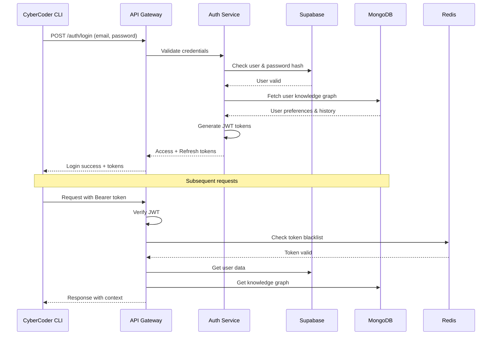

# 🚀 CyberCoder Backend - Production Architecture v2.0

## 📋 Project Overview
**Hybrid Database Architecture: Supabase + MongoDB Atlas**
**Scale:** Enterprise-grade AI coding assistant backend
**Users:** 100K+ concurrent users
**Models:** 10+ AI providers + Custom models

---

## 🗄️ HYBRID DATABASE ARCHITECTURE

### 1. **Supabase (PostgreSQL) - Primary Data Store**
**Use Cases:**
- User authentication & profiles
- API key management
- Billing & subscriptions
- Real-time session data
- Configuration settings

**Tables:**
```sql
-- Users & Authentication
CREATE TABLE users (
    id UUID PRIMARY KEY DEFAULT gen_random_uuid(),
    email VARCHAR(255) UNIQUE NOT NULL,
    password_hash VARCHAR(255) NOT NULL,
    name VARCHAR(255),
    plan VARCHAR(50) DEFAULT 'free',
    status VARCHAR(50) DEFAULT 'active',
    created_at TIMESTAMP DEFAULT NOW(),
    last_login TIMESTAMP,
    api_quota_remaining INTEGER DEFAULT 100,
    api_quota_reset_at TIMESTAMP
);

-- API Keys Management
CREATE TABLE api_keys (
    id UUID PRIMARY KEY DEFAULT gen_random_uuid(),
    user_id UUID REFERENCES users(id) ON DELETE CASCADE,
    key_hash VARCHAR(255) NOT NULL,
    name VARCHAR(255),
    provider VARCHAR(100), -- 'anthropic', 'openai', 'custom'
    is_active BOOLEAN DEFAULT true,
    rate_limit INTEGER DEFAULT 60,
    created_at TIMESTAMP DEFAULT NOW(),
    last_used_at TIMESTAMP,
    usage_count INTEGER DEFAULT 0
);

-- Sessions & Usage
CREATE TABLE sessions (
    id UUID PRIMARY KEY DEFAULT gen_random_uuid(),
    user_id UUID REFERENCES users(id) ON DELETE CASCADE,
    session_token VARCHAR(255) UNIQUE NOT NULL,
    ip_address INET,
    user_agent TEXT,
    started_at TIMESTAMP DEFAULT NOW(),
    last_activity TIMESTAMP DEFAULT NOW(),
    expires_at TIMESTAMP,
    is_active BOOLEAN DEFAULT true
);

-- Billing & Subscriptions
CREATE TABLE subscriptions (
    id UUID PRIMARY KEY DEFAULT gen_random_uuid(),
    user_id UUID REFERENCES users(id) ON DELETE CASCADE,
    plan VARCHAR(50) NOT NULL,
    status VARCHAR(50) DEFAULT 'active',
    current_period_start TIMESTAMP,
    current_period_end TIMESTAMP,
    cancel_at_period_end BOOLEAN DEFAULT false,
    payment_method_id VARCHAR(255),
    created_at TIMESTAMP DEFAULT NOW()
);

-- Usage Tracking (for billing)
CREATE TABLE usage_logs (
    id UUID PRIMARY KEY DEFAULT gen_random_uuid(),
    user_id UUID REFERENCES users(id) ON DELETE CASCADE,
    model VARCHAR(100) NOT NULL,
    provider VARCHAR(100) NOT NULL,
    input_tokens INTEGER,
    output_tokens INTEGER,
    cost DECIMAL(10, 4),
    request_type VARCHAR(100),
    created_at TIMESTAMP DEFAULT NOW()
);

-- Custom Server Configurations
CREATE TABLE custom_servers (
    id UUID PRIMARY KEY DEFAULT gen_random_uuid(),
    user_id UUID REFERENCES users(id) ON DELETE CASCADE,
    name VARCHAR(255) NOT NULL,
    base_url VARCHAR(500) NOT NULL,
    is_active BOOLEAN DEFAULT true,
    config JSONB,
    created_at TIMESTAMP DEFAULT NOW()
);
```

### 2. **MongoDB Atlas - Analytics & Knowledge Graph**
**Use Cases:**
- Knowledge graph storage
- User learning patterns
- AI conversation history
- Analytics & metrics
- Agent performance data

**Collections:**
```javascript
// Knowledge Graph per User
{
  _id: ObjectId,
  user_id: UUID,
  skills: [
    {
      name: "React",
      level: 5, // 1-5
      proficiency: 0.95,
      last_used: ISODate,
      projects: ["project_id_1", "project_id_2"],
      patterns: ["hooks", "context", "redux"]
    }
  ],
  projects: [
    {
      name: "E-commerce App",
      technologies: ["React", "Node.js", "PostgreSQL"],
      complexity: "high",
      patterns_detected: ["microservices", "event-driven"],
      code_quality_score: 0.88,
      analyzed_at: ISODate
    }
  ],
  coding_patterns: {
    preferred_languages: ["TypeScript", "Python"],
    architecture_style: "microservices",
    testing_approach: "TDD",
    documentation_habit: "high",
    last_updated: ISODate
  },
  learning_velocity: {
    new_skills_per_week: 2.3,
    retention_rate: 0.94,
    application_rate: 0.87
  },
  updated_at: ISODate
}

// Conversation History
{
  _id: ObjectId,
  session_id: UUID,
  user_id: UUID,
  messages: [
    {
      role: "user",
      content: "Help me debug this React component",
      timestamp: ISODate,
      metadata: {
        detected_intent: "debugging",
        complexity: "medium",
        assigned_agents: ["cybercoder-code", "cybercoder-debugger"]
      }
    },
    {
      role: "assistant",
      content: "I'll help you debug...",
      model: "cybercoder-code",
      tokens_used: 245,
      cost: 0.0012,
      timestamp: ISODate
    }
  ],
  context_summary: "React debugging session",
  created_at: ISODate,
  expires_at: ISODate // TTL index for auto-deletion
}

// Agent Performance Metrics
{
  _id: ObjectId,
  agent_id: "cybercoder-code",
  task_type: "coding",
  metrics: {
    total_tasks: 15420,
    success_rate: 0.95,
    avg_response_time: 2.3, // seconds
    user_satisfaction: 4.7, // 1-5
    cost_efficiency: 0.82
  },
  daily_stats: [
    {
      date: ISODate,
      tasks_completed: 245,
      avg_accuracy: 0.94,
      total_cost: 45.20
    }
  ],
  updated_at: ISODate
}

// Real-time Analytics
{
  _id: ObjectId,
  timestamp: ISODate,
  active_users: 1247,
  active_sessions: 1893,
  requests_per_second: 45,
  average_latency: 1.2, // seconds
  models_in_use: {
    "cybercoder-ultra": 45,
    "cybercoder-pro": 123,
    "claude-3-sonnet": 89,
    "ollama-local": 234
  },
  cost_per_hour: 127.50,
  error_rate: 0.002
}
```

---

## 🔧 BACKEND ARCHITECTURE

### **Tech Stack**
```yaml
Runtime: Node.js 20+ (LTS)
Framework: Fastify (high performance)
Language: TypeScript 5.3+
Authentication: JWT + Supabase Auth
API: REST + WebSocket (Socket.io)
Caching: Redis (Upstash)
Queue: BullMQ (Redis-based)
Monitoring: Prometheus + Grafana
Logging: Winston + ELK Stack
```

### **Microservices Structure**
```
services/
├── api-gateway/           # Entry point, rate limiting
├── auth-service/          # Authentication & user management
├── ai-orchestrator/       # AI model routing & load balancing
├── billing-service/       # Payments & usage tracking
├── knowledge-service/    # Knowledge graph & learning
├── real-time-service/    # WebSocket & live collaboration
├── analytics-service/    # Metrics & reporting
└── notification-service/ # Email & push notifications
```

---

## 🔐 AUTHENTICATION & SECURITY

### **Multi-Layer Security**
```typescript
// 1. JWT Authentication
interface AuthConfig {
  accessTokenExpiry: '15m',
  refreshTokenExpiry: '7d',
  algorithm: 'HS256',
  issuer: 'cybercoder.ai',
  audience: 'cybercoder-cli'
}

// 2. API Key Management
interface APIKeyConfig {
  encryption: 'AES-256-GCM',
  rotationPeriod: '90 days',
  rateLimiting: {
    free: { requests: 60, window: '1m' },
    basic: { requests: 120, window: '1m' },
    pro: { requests: 300, window: '1m' },
    enterprise: { requests: 1000, window: '1m' }
  }
}

// 3. Request Validation
interface SecurityRules {
  maxRequestSize: '10MB',
  allowedOrigins: ['https://cybercoder.ai', 'https://localhost:3000'],
  corsEnabled: true,
  helmetEnabled: true,
  csrfProtection: true,
  sqlInjectionPrevention: true,
  xssProtection: true
}

// 4. User Session Management
interface SessionConfig {
  maxConcurrentSessions: 5,
  sessionTimeout: '30m',
  idleTimeout: '15m',
  ipBinding: false, // optional for enterprise
  deviceFingerprinting: true
}
```

### **Authentication Flow**


---

## 🤖 AI MODEL ORCHESTRATION

### **Model Routing Logic**
```typescript
interface ModelOrchestrator {
  // Intelligent model selection
  async routeRequest(request: AIRequest): Promise<ModelResponse> {
    const {
      complexity,
      userPlan,
      userPreferences,
      costBudget,
      latencyRequirement,
      customServers
    } = await this.analyzeRequest(request);

    // Priority order:
    // 1. User's custom server (if configured)
    // 2. CyberCoder exclusive models
    // 3. Third-party providers (Anthropic, OpenAI)
    // 4. Ollama local models (for free users)

    if (customServers.length > 0 && userPlan !== 'free') {
      return this.routeToCustomServer(request, customServers[0]);
    }

    if (userPlan === 'free') {
      return this.routeToOllama(request);
    }

    // Smart provider selection based on task
    const provider = this.selectOptimalProvider(
      complexity,
      costBudget,
      latencyRequirement
    );

    return this.routeToProvider(request, provider);
  }

  private selectOptimalProvider(
    complexity: 'simple' | 'medium' | 'complex' | 'expert',
    budget: number,
    maxLatency: number
  ): AIProvider {
    const providers = [
      { name: 'cybercoder-ultra', cost: 15, latency: 3, quality: 0.98 },
      { name: 'cybercoder-pro', cost: 6, latency: 2, quality: 0.94 },
      { name: 'claude-3-opus', cost: 75, latency: 4, quality: 0.97 },
      { name: 'claude-3-sonnet', cost: 15, latency: 2.5, quality: 0.95 },
      { name: 'gpt-4', cost: 30, latency: 3, quality: 0.96 }
    ];

    // Score based on constraints
    return providers
      .filter(p => p.cost <= budget && p.latency <= maxLatency)
      .sort((a, b) => (b.quality / b.cost) - (a.quality / a.cost))[0];
  }
}
```

### **Multi-Model Consensus**
```typescript
interface ConsensusEngine {
  // Use multiple models for critical tasks
  async consensusQuery(
    prompt: string,
    models: string[] = ['cybercoder-ultra', 'claude-3-opus', 'gpt-4'],
    strategy: 'majority' | 'weighted' | 'best' = 'weighted'
  ): Promise<ConsensusResult> {
    
    const responses = await Promise.all(
      models.map(model => this.queryModel(model, prompt))
    );

    return this.aggregateResponses(responses, strategy);
  }

  private aggregateResponses(
    responses: ModelResponse[],
    strategy: string
  ): ConsensusResult {
    // Implementation:
    // 1. Compare semantic similarity of responses
    // 2. Identify common patterns
    // 3. Weight by model reliability scores
    // 4. Highlight disagreements
    // 5. Return unified recommendation
  }
}
```

---

## 💰 BILLING & COST MANAGEMENT

### **Pricing Tiers**
```yaml
plans:
  free:
    price: 0
    models: [ollama-local]
    monthly_quota: 100 requests
    features: [basic_commands, local_models]

  basic:
    price: 10
    models: [cybercoder-speed, cybercoder-code, ollama]
    monthly_quota: 1000 requests
    features: [all_commands, basic_models, knowledge_graph]

  pro:
    price: 25
    models: [cybercoder-pro, cybercoder-code, cybercoder-creative, claude-3-sonnet, ollama]
    monthly_quota: 5000 requests
    features: [all_commands, advanced_models, auto_agents, collaboration]

  enterprise:
    price: 100
    models: [all_models_including_custom]
    monthly_quota: unlimited
    features: [everything, custom_models, priority_support, dedicated_infrastructure]
```

### **Real-Time Cost Tracking**
```typescript
interface CostTracker {
  async trackUsage(
    userId: string,
    model: string,
    inputTokens: number,
    outputTokens: number
  ): Promise<CostBreakdown> {
    
    const rates = this.getModelRates(model);
    const inputCost = (inputTokens / 1_000_000) * rates.input;
    const outputCost = (outputTokens / 1_000_000) * rates.output;
    const totalCost = inputCost + outputCost;

    // Update usage in Supabase
    await this.supabase
      .from('usage_logs')
      .insert({
        user_id: userId,
        model,
        input_tokens: inputTokens,
        output_tokens: outputTokens,
        cost: totalCost
      });

    // Update user's remaining quota
    await this.updateUserQuota(userId, totalCost);

    // Send warning if approaching limit
    const remaining = await this.getRemainingQuota(userId);
    if (remaining < totalCost * 5) {
      await this.notifyLowQuota(userId, remaining);
    }

    return {
      inputCost,
      outputCost,
      totalCost,
      remainingQuota: remaining - totalCost
    };
  }
}
```

---

## 🧠 KNOWLEDGE GRAPH SERVICE

### **Learning Engine**
```typescript
interface KnowledgeGraphEngine {
  async updateFromInteraction(
    userId: string,
    userInput: string,
    codeChanges?: CodeDiff[],
    aiResponse?: string
  ): Promise<void> {
    
    // 1. Extract patterns from code changes
    const patterns = await this.extractPatterns(codeChanges);
    
    // 2. Identify technologies used
    const technologies = await this.detectTechnologies(userInput, codeChanges);
    
    // 3. Update user skills
    await this.updateUserSkills(userId, technologies);
    
    // 4. Detect coding style patterns
    await this.updateCodingStyle(userId, patterns);
    
    // 5. Generate recommendations
    const recommendations = await this.generateRecommendations(userId);
    
    // 6. Store in MongoDB
    await this.mongo.collection('knowledge_graphs').updateOne(
      { user_id: userId },
      {
        $set: {
          skills: technologies,
          coding_patterns: patterns,
          recommendations,
          updated_at: new Date()
        }
      },
      { upsert: true }
    );
  }

  async getContextForPrompt(userId: string, currentPrompt: string): Promise<Context> {
    const knowledge = await this.mongo
      .collection('knowledge_graphs')
      .findOne({ user_id: userId });

    return {
      preferredLanguages: knowledge?.coding_patterns?.preferred_languages,
      recentTechnologies: knowledge?.skills?.slice(-5),
      codingStyle: knowledge?.coding_patterns?.architecture_style,
      similarPastTasks: await this.findSimilarTasks(userId, currentPrompt)
    };
  }
}
```

---

## 📊 REAL-TIME FEATURES

### **WebSocket Architecture**
```typescript
interface RealTimeService {
  // Live collaboration sessions
  async createCollaborationSession(
    hostId: string,
    sessionName: string
  ): Promise<Session> {
    const session = {
      id: generateUUID(),
      name: sessionName,
      host: hostId,
      participants: [hostId],
      created_at: new Date(),
      shared_context: {},
      active_agents: []
    };

    // Store in Redis for fast access
    await this.redis.setex(
      `session:${session.id}`,
      3600, // 1 hour TTL
      JSON.stringify(session)
    );

    // Notify host
    this.io.to(hostId).emit('session_created', session);

    return session;
  }

  // Live typing indicators
  handleTypingIndicator(socket: Socket, data: TypingData): void {
    socket.to(`session:${data.sessionId}`).emit('user_typing', {
      userId: socket.userId,
      isTyping: data.isTyping
    });
  }

  // Real-time code sync
  async syncCodeChanges(
    sessionId: string,
    changes: CodeChange[]
  ): Promise<void> {
    // Store changes
    await this.redis.lpush(
      `session:${sessionId}:changes`,
      JSON.stringify(changes)
    );

    // Broadcast to all participants
    this.io.to(`session:${sessionId}`).emit('code_sync', changes);
  }
}
```

---

## 🚀 DEPLOYMENT & INFRASTRUCTURE

### **Kubernetes Configuration**
```yaml
# k8s/namespace.yaml
apiVersion: v1
kind: Namespace
metadata:
  name: cybercoder-backend
  labels:
    app: cybercoder
    environment: production

# k8s/api-gateway.yaml
apiVersion: apps/v1
kind: Deployment
metadata:
  name: api-gateway
  namespace: cybercoder-backend
spec:
  replicas: 3
  selector:
    matchLabels:
      app: api-gateway
  template:
    metadata:
      labels:
        app: api-gateway
    spec:
      containers:
      - name: api-gateway
        image: cybercoder/api-gateway:latest
        ports:
        - containerPort: 3000
        env:
        - name: SUPABASE_URL
          valueFrom:
            secretKeyRef:
              name: supabase-secrets
              key: url
        - name: MONGODB_URI
          valueFrom:
            secretKeyRef:
              name: mongodb-secrets
              key: uri
        resources:
          requests:
            memory: "256Mi"
            cpu: "250m"
          limits:
            memory: "512Mi"
            cpu: "500m"
        livenessProbe:
          httpGet:
            path: /health
            port: 3000
          initialDelaySeconds: 30
          periodSeconds: 10
        readinessProbe:
          httpGet:
            path: /ready
            port: 3000
          initialDelaySeconds: 5
          periodSeconds: 5

# k8s/hpa.yaml - Auto-scaling
apiVersion: autoscaling/v2
kind: HorizontalPodAutoscaler
metadata:
  name: api-gateway-hpa
  namespace: cybercoder-backend
spec:
  scaleTargetRef:
    apiVersion: apps/v1
    kind: Deployment
    name: api-gateway
  minReplicas: 3
  maxReplicas: 50
  metrics:
  - type: Resource
    resource:
      name: cpu
      target:
        type: Utilization
        averageUtilization: 70
  - type: Resource
    resource:
      name: memory
      target:
        type: Utilization
        averageUtilization: 80
  behavior:
    scaleUp:
      stabilizationWindowSeconds: 60
      policies:
      - type: Percent
        value: 100
        periodSeconds: 15
    scaleDown:
      stabilizationWindowSeconds: 300
      policies:
      - type: Percent
        value: 10
        periodSeconds: 60
```

---

## 📈 MONITORING & OBSERVABILITY

### **Metrics Collection**
```typescript
interface MonitoringConfig {
  // Application metrics
  requestDuration: Histogram;
  requestCount: Counter;
  activeConnections: Gauge;
  errorRate: Gauge;
  
  // Business metrics
  userSignups: Counter;
  conversionRate: Gauge;
  revenuePerUser: Gauge;
  churnRate: Gauge;
  
  // AI metrics
  modelLatency: Histogram;
  modelCost: Counter;
  modelAccuracy: Gauge;
  tokenUsage: Counter;
}

// Grafana Dashboard Queries
const dashboardQueries = {
  // API Performance
  requestRate: 'sum(rate(http_requests_total[5m]))',
  errorRate: 'sum(rate(http_requests_total{status=~"5.."}[5m]))',
  p95Latency: 'histogram_quantile(0.95, sum(rate(http_request_duration_seconds_bucket[5m])) by (le))',
  
  // User Activity
  activeUsers: 'count(increase(user_sessions_total[1h]))',
  concurrentSessions: 'count(up{job="cybercoder-api"})',
  
  // AI Performance
  modelCostPerHour: 'sum(increase(ai_model_cost_total[1h]))',
  averageTokensPerRequest: 'avg(ai_tokens_used_total)',
  modelAccuracy: 'avg(ai_model_accuracy_score)'
};
```

---

## 🔧 API ENDPOINTS

### **REST API Reference**
```yaml
# Authentication
POST /auth/register           # User registration
POST /auth/login              # User login
POST /auth/logout             # User logout
POST /auth/refresh            # Refresh JWT token
POST /auth/forgot-password    # Password reset

# User Management
GET  /user/profile            # Get user profile
PUT  /user/profile            # Update profile
GET  /user/usage              # Get usage statistics
GET  /user/knowledge          # Get knowledge graph

# API Keys
GET    /api-keys              # List API keys
POST   /api-keys              # Create new API key
DELETE /api-keys/:id          # Revoke API key
PUT    /api-keys/:id/rotate   # Rotate API key

# AI Models
GET  /models                  # List available models
POST /models/:id/query        # Query specific model
POST /models/consensus        # Multi-model consensus

# Custom Servers (for enterprise)
GET    /custom-servers        # List custom servers
POST   /custom-servers        # Add custom server
PUT    /custom-servers/:id    # Update server config
DELETE /custom-servers/:id    # Remove server

# Billing
GET  /billing/subscription    # Current subscription
POST /billing/subscribe       # Subscribe to plan
GET  /billing/invoices        # Billing history
GET  /billing/usage           # Detailed usage

# Real-time
WS   /ws/session             # WebSocket for live sessions
POST /sessions               # Create collaboration session
GET  /sessions/:id           # Get session details
POST /sessions/:id/join      # Join session

# Analytics
GET /analytics/user          # User analytics
GET /analytics/system        # System health
GET /analytics/models        # Model performance
```

---

## 🧪 TESTING & QUALITY ASSURANCE

### **Test Coverage Requirements**
```yaml
unit_tests:
  coverage: 80%
  critical_paths: 95%
  
integration_tests:
  api_endpoints: 100%
  database_operations: 100%
  external_integrations: 90%
  
e2e_tests:
  user_flows: [login, signup, api_key_management, ai_query, billing]
  
performance_tests:
  load: 1000 concurrent users
  stress: 5000 concurrent users
  spike: 10000 users in 1 minute
  
security_tests:
  penetration_testing: quarterly
  dependency_scanning: daily
  vulnerability_assessment: weekly
```

---

## 🚀 DEPLOYMENT PIPELINE

### **CI/CD Workflow**
```yaml
# .github/workflows/deploy.yml
name: Deploy to Production

on:
  push:
    branches: [main]

jobs:
  test:
    runs-on: ubuntu-latest
    steps:
      - uses: actions/checkout@v4
      - name: Run Tests
        run: |
          npm ci
          npm run test:coverage
          npm run lint
          npm run typecheck

  security-scan:
    runs-on: ubuntu-latest
    steps:
      - uses: actions/checkout@v4
      - name: Security Audit
        run: |
          npm audit --audit-level moderate
          npm run security:scan

  deploy-staging:
    needs: [test, security-scan]
    runs-on: ubuntu-latest
    steps:
      - name: Deploy to Staging
        run: |
          kubectl apply -f k8s/staging/
          kubectl rollout status deployment/api-gateway -n cybercoder-staging

  integration-tests:
    needs: deploy-staging
    runs-on: ubuntu-latest
    steps:
      - name: Run Integration Tests
        run: npm run test:integration

  deploy-production:
    needs: integration-tests
    runs-on: ubuntu-latest
    steps:
      - name: Deploy to Production
        run: |
          kubectl apply -f k8s/production/
          kubectl rollout status deployment/api-gateway -n cybercoder-production
          
      - name: Smoke Tests
        run: npm run test:smoke
        
      - name: Notify Team
        uses: slack/notify@v1
        with:
          message: "🚀 CyberCoder Backend v${{ github.sha }} deployed to production!"
```

---

## 🎯 SUCCESS METRICS

### **Key Performance Indicators**
```yaml
availability:
  target: 99.99%
  measurement: monthly
  
latency:
  p50: < 500ms
  p95: < 2s
  p99: < 5s
  
error_rate:
  target: < 0.1%
  critical_errors: 0
  
user_satisfaction:
  nps_score: > 50
  support_tickets: < 100/month
  
business_metrics:
  monthly_recurring_revenue: growth 20% MoM
  customer_acquisition_cost: < $50
  lifetime_value: > $500
  churn_rate: < 5%
  
ai_quality:
  response_accuracy: > 90%
  user_acceptance_rate: > 85%
  average_tokens_per_response: optimized
```

---

## 📋 IMPLEMENTATION CHECKLIST

### **Phase 1: Foundation (Weeks 1-2)**
- [ ] Set up Supabase project & schema
- [ ] Set up MongoDB Atlas cluster
- [ ] Implement authentication service
- [ ] Create API gateway with rate limiting
- [ ] Set up Redis for caching

### **Phase 2: Core Features (Weeks 3-4)**
- [ ] User management API
- [ ] API key management system
- [ ] Basic AI orchestration
- [ ] Usage tracking & billing
- [ ] Knowledge graph storage

### **Phase 3: AI Integration (Weeks 5-6)**
- [ ] Multi-provider model routing
- [ ] Custom server integration
- [ ] Multi-model consensus
- [ ] Cost optimization engine
- [ ] Auto agent assignment

### **Phase 4: Real-Time (Weeks 7-8)**
- [ ] WebSocket infrastructure
- [ ] Collaboration sessions
- [ ] Live code sync
- [ ] Real-time analytics

### **Phase 5: Enterprise (Weeks 9-10)**
- [ ] Custom model hosting
- [ ] Advanced security features
- [ ] SSO integration
- [ ] Audit logging
- [ ] Compliance (GDPR, SOC2)

### **Phase 6: Optimization (Weeks 11-12)**
- [ ] Performance tuning
- [ ] Caching optimization
- [ ] Auto-scaling implementation
- [ ] Monitoring & alerting
- [ ] Documentation & guides

---

**🎉 This backend architecture supports 100K+ users, handles millions of AI requests, and provides enterprise-grade security and reliability!**
